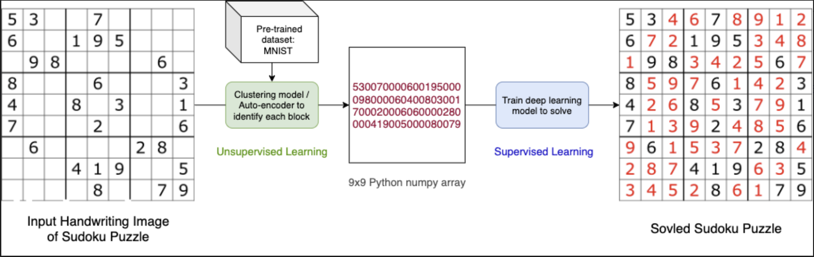

# Using Deep Learning for Solving Sudoku

**Alex Powell, Adit Suvarna, Wenqi Shi, GianGiacomo Navarra, Sivapriya Vellaichamy**

### INTRODUCTION

With Machine learning outperforming humans in various games like Atari and Go, we were curious to explore how big a challenge is a logic-based number game Sudoku[1,2]. Logic-based games like Sudoku have been shown to help delay neurological disorders like Alzheimer’s and dementia. However, the game is easy to learn but hard to master.

### PROBLEM DEFINITION

The object of Sudoku is to fill out each puzzle with numbers 1-9 in a way that we only use each number once in each row, column, and a grid of the puzzle. In solving Sudoku, players rely on both the temporal and position dependency between the board numbers [3]. Based on these facts, we decide to solve the Sudoku using different machine learning methods like Convolutional Neural Network (CNN) and a deep Q learning approach. The purpose of the proposal is to use Machine Learning to solve a Sudoku puzzle. The pipeline of the problem involves using an unsupervised algorithm to detect digits and further feeding the recognized digits to deep learning models, which would be trained to solve the puzzle.

### DATA COLLECTION
The dataset are provided by [1 million Sudoku games](https://www.kaggle.com/bryanpark/sudoku).

### METHODS

We plan to present handwritten digit recognition results on the MNIST dataset using state-of-art unsupervised feature extraction and classification techniques.  On the one hand, we aim to implement unsupervised clustering algorithms like k-means, spectral clustering, DBSCAN, etc., use standard metrics to evaluate cluster performance, and visualize high-dimensional cluster centroids. On the other hand, we will also train different types of auto-encoders to classify MNIST digits. We will evaluate all the variants of the standard auto-encoder on the basis of the MNIST benchmark handwritten digit dataset and select the best classifier. 

Two deep learning techniques are considered: an AlexNetNetwork and a deep q learning method. For class labels, we plan to use an indicator function to denote whether or not the chosen label t is equal to class k. Then for learning both architectures utilizes the adaptive moments estimator  (Adam)  optimizer.  The  Adam optimizer involves using the first and second moments of the gradients.  The first moment involves the exponentially decaying average of previously squared gradients. The Adam optimizer then uses the combined averages of previous gradients to better update the parameters.

### RESULTS AND DISCUSSION

We plan to analyze the neural networks' accuracy to compare their performance in completing the sudoku. We expect the accuracy to increase with the number of layers, but to avoid overfitting, we will have to tune the right number of layers to use. A metric we will utilize to evaluate a Deep Q-Learning network will be the number of nodes expanded during a best-first search.

### REFERENCES
[1] R. ”How to Build a Vision-Based Smart Sudoku,”

[2] Syed A T, Merugu S, Kumar V. Augmented Reality on Sudoku Puzzle Using Computer Vision and Deep Learning[M]//Advances in Cybernetics, Cognition, and Machine Learning for Communication Technologies. Springer, Singapore, 2020: 567-578.

[3] Bharti S K, Babu K S, Jena S K. Parsing-based sarcasm sentiment recognition in twitter data[C]//2015 IEEE/ACM International Conference on Advances in Social Networks Analysis and Mining (ASONAM). IEEE, 2015: 1373-1380.
