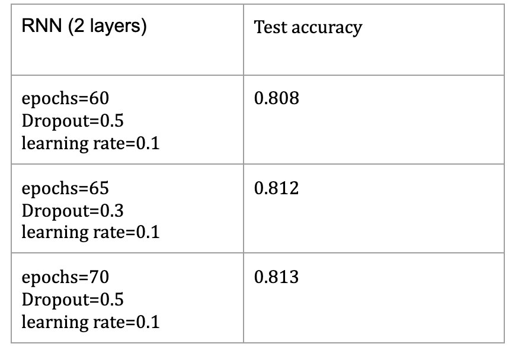

# Using Deep Learning for Solving Sudoku

**Alex Powell, Adit Suvarna, Wenqi Shi, GianGiacomo Navarra, Sivapriya Vellaichamy**

### INTRODUCTION

With Machine learning outperforming humans in a variety of games like Atari and Go, we were curious to explore how big a challenge is the logic based number game - Sudoku[1,2]. This is one of the games that are easy to learn but hard to master. Interestingly, logic based games like Sudoku have been shown to help delay neurological disorders like Alzheimer’s and dementia. 

### PROBLEM DEFINITION

The object of Sudoku is to fill out each puzzle with numbers 1-9 in a way that we only use each number once in each row, column, and a grid of the puzzle. In solving Sudoku, players rely on both the temporal and position dependency between the board numbers [3]. Based on these facts, we decide to solve the Sudoku using different machine learning methods like Convolutional Neural Network (CNN) and a deep Q learning approach. The purpose of the proposal is to use Machine Learning to solve a Sudoku puzzle. The pipeline of the problem involves using an unsupervised algorithm to detect digits and further feeding the recognized digits to deep learning models, which would be trained to solve the puzzle. 

 feeding into a sudoku solver (Supervised).")

> Fig 1. Flowchart of proposed method: A handwriting recogniser (Unsupervised) feeding into a sudoku solver (Supervised).

### DATA COLLECTION AND PRE-PROCESSING

**Unsupervised**: The MNIST database of handwritten digits has a training set of 60,000 examples, and a test set of 10,000 examples. The digits have been size-normalized and centered in a fixed-size image.

**Supervised**: The Kaggle dataset “1 million sudoku games” is publically  available and provided by [1 million Sudoku games](https://www.kaggle.com/bryanpark/sudoku).The dataset contains two columns. The column quizzes contain the unsolved sudoku while the column solution has respective solved games. Each game is represented by a numpy array of 81 numbers. For the one-hot encoding, each of the numbers here is considered as a category because the value of the number itself does not hold any significance i.e. predicting a 4 as 5 is as bad as predicting it as 9. For this reason we consider each as a categorical input and we use one hot encoding before feeding it into the algorithm. This would mean that each of the 81 numbers is sent as a sequence of 9 numbers. 

### METHODS

**Unsupervised:** In this part, we implement an auto-encoder as a classifier and train it on MNIST dataset. An autoencoder is a type of artificial neural network trained to learn efficient data codings by attempting to copy its input to its output. The aim of an autoencoder is to learn a representation (encoding) from the input by training the network to ignore signal noise. To be specific, the input is a 28 by 28 image of a handwriting digit and the output is the reconstruction result with predicted label. Internally, it has a hidden layer h that describes a code used to represent the input. The network can be viewed as two consistent parts: an encoder function h=f(x) and a decoder that produces a reconstruction r=g(h). In addition to the original auto-encoder-decoder structure, we add a classification model with softmax output layer to combine with the encoder for a full image classification pipeline.

> Fig 2. Autoencoder as a Classifier using MNIST Dataset.

**Supervised:** The sudoku solver is essentially a multiclass classification task. We consider two different algorithms: 1) Multi-layer perceptron 2) Convolutional neural network. We expect our model to predict the most probable digit as we do in classification tasks. 

*Multi Layer Perceptron:* In our Multilinear Perceptron we consider the Adadelta optimizer with a learning rate 0.1. We train the network for 10 epochs  with batch size 50 and  use a final softmax layer to generate probability values. The argmax over the soft probability was taken to choose the most likely probability for a given cell.  

*Convolutional Neural Network*: For our Convolutional Neural Network the Adadelta optimizer has been used with learning rate 0.1. We train the network for 10 epochs  with batch size 50 and  use a final softmax layer to generate probability values. The argmax over the soft probability was taken to choose the most likely probability for a given cell. 

*Bidirectional Recurrent Neural Network*: For the Recurrent Neural Network we took  one Long short term memory units (LSTM) with 500 hidden units. 

**Evaluation metric:**
The choice of evaluation metric is crucial as we would want to best identify the level of current performance so as to improve it in the future. We identify three different metrics that is applicable for the scenario.

_Full accuracy:_ This is the evaluation metric that is closest to how humans are evaluated on the game. This means that you have to get all the blanks of the sudoku correct to be classified as a correct solution. It's an all-or-nothing evaluation. 

_Semi Accuracy:_ This metric looks at the percentage of cells correctly placed in the overall puzzle.

_Semi Accuracy 2:_ This metric identifies the percentage of blank cells from the unfilled Sudoku that were correctly identified.

### RESULTS AND DISCUSSION

#### Unsupervised Learning 
The best performance result is obtained for epoch=100, loss=0.113, accuracy =0.9670. As we can see from the example below, the reconstruction results and prediction accuracy are pretty good. The autoencoder successfully encodes and decodes the latent space vectors with high quality. 

> Fig 3. Example of recounstruction results of auto-encoder and predicted labels.

> Fig 4. Plots of training history and accuary of unsurpervised portion.

#### Supervised Learning
The primary metric used for both the multilayer perceptron and the convolutional neural network to evaluate the performance of the model is Semi Accuracy. 

#### Multilayer Perceptron
In Fig.5 the loss function is represented for the MLP in the case of validation and training. To be specific, Fig 5 plots loss reduction with epochs for MLP using validation and training data. As Fig 3 explains, we get a Semi accuracy of around 80%. Figure 2a) is indicative of training while Figure 2b) is for validation. We don't see a drastic gap between them after adequate hyper parameter tuning to avoid overfitting.   

> Fig 5. The training and validation loss for the Multi-layer Perceptron

For the MLP we got a Semi accuracy around 80%, as shown in Fig.6. The blue line is indicative of the training while the red one is for validation. The results are then compared with a convolutional neural network  of 2 layer networks. We are planning to consider a deeper neural network with a higher number of layers  in order to optimize the best number without going overfitting.

> Fig 6. In the left figure, we represent the percentage of cells correctly filled over each epoch; and in the right figure, we have the percentage of blank cells correctly filled out by the MLP.

#### Convolutional Neural Network

Deeper neural networks have a higher potential to fit the non linearities in the data well. Therefore, we try a 2 layer convolutional neural network followed by another 4 layer convolutional neural network architectures. We perform hyper parameter tuning in order to optimize for the best accuracy without overfitting. We have used in this case K fold cross validation in order to assess how well the model generalises.

> Table 1

In Fig.7 we represent the loss function calculated with the two layer convolutional neural network using the optimization of hyperparameters that leads to highest test accuracy. 

> Fig 7. The loss function for training and and validation data for the two layer CNN.

The Semi accuracy obtained with the CNN for training and validation is represented in Fig.8.

> Fig 8. In the left figure, we represent the percentage of cells correctly filled on the training and validation data for the CNN while in the right one, we have the percentage of blank cells correctly filled by the CNN. 

Both the MLP and the two layer CNN  gives an accuracy around 83%  for the training and validation. The values of training and validation accuracy being close to each other (~83%) indicates the hyper parameters do a good job on avoiding overfitting. 

At an attempt to learn better, we increase the depth to try a CNN with four layers.

> Table 2

#### Bidirectional Recurrent Neural Network 
As a second method a Bidirectional Neural Network has been used. We took Long short term memory units (LSTM) with 500 hidden units. The LSTM converts the 81 length string into 81x9 one hot labeled representation. The labels in this case represent the number of each cell in a sudoku board. The output from the LSTM layer is then used as an input for a feed-forward network with 9 neurons. We score each cell with the probability of this cell being a certain number. This is done by a softmax activation function for each cell. 

> Table 3

Also for the BiRNN  we take into consideration the case with higher test accuracy. As shown in figure 9 we needed to train the model with a much higher number of epochs so to achieve the accuracy obtained with the CNN.  

> Fig. 11 The loss function for training and and validation data for the four layers RNN

> Fig. 12 In a) we represent  the percentage of cells correctly filled on the training and validation data for the RNN while in b) we have the percentage of blank cells correctly filled.

#### Batch Solve
For the neural networks, we also implemented a solve and batchSolve function that fills in cells one at a time according to the most likely value obtained from the output of the neural network, following a greedy approach. These functions showed a dramatic increase in accuracy across all of the neural networks, and was solving the majority of the test problems correctly. The results can be seen in the table below.

> Table 4

#### Accuracy Check with Other Machine Algorithms
As a reference to compare the accuracy numbers and how hard the problem is to solve using Machine Learning algorithms, we use two models other than Deep Learning to get the accuracy. 

-- RandomForest Classifier

-- Support Vector Classifier (RBF kernel)

The problem formulation and data handling are all the same - we input 81 categorical variables each with 9 categorical levels and get 81 categorical variables each with 9 categorical levels. This is a Multi Output multiclass classification.

**Random Forest Classifier**:

This classifier does not make strict assumptions. It is non parametric and therefore works with Skewed or multimodal data points. It handles both categorical and continuous valued inputs/outputs well. 

**Support Vector Classifier**:

This classifier works on the principle of finding a maximum margin hyperplane. Although the linear kernel is fast, we want better performance hence we use the ‘rbf’ kernel for our soft learning classifier. In the case of the SVM Classifier, we see that the training with a large number of samples takes a very long time, so we train on 10000 examples and predict on 1000 other samples. 

> Table 5

The semi accuracy 2 (percentage of blank cells from the unfilled Sudoku that were correctly identified) for the test set is almost the same for both the classifiers and is only slightly better than random. In case of Semi Accuracy, Random Forest performs better than SVMs but both are much behind the performance of neural networks. A possible reason could be the scalability issue or logical dependency between the inputs (Set of collection in a row, column and mini grid would be 1-9). 

Overall, we see here that additional ML models produce accuracies much lesser than the different deep learning models further reinforcing the efficiency of Neural networks for this type of logic based problems especially MultiOutput Multiclass type problems. 

### SUMMARY and CONCLUSION
We explored the possibility of using Deep Learning Models to solve logic based games taking the case of Sudoku. In the design of the problem solving pipeline, we made use of the encoder decoder (unsupervised) to extract the features which are then used to recognise the handwritten digits. When implemented, the output of the digits would serve as the input of an array of 81 numbers to the Neural network (Supervised) which would output another array of 81 numbers indicating the solved puzzle.

In the supervised section we used different neural network architectures to solve the sudoku. After reasonable iterations of hyper parameter tuning and trying different architectures, we achieve with the CNNs and the RNN an accuracy of over 83%. When attempted to solve the problem using batch solve - filling one block at a time with the highest probability- we get 99.99% accuracy.  Further, testing using other ML algorithms like Random Forest and SVM classifiers only produce results slightly better than random. This suggests that it is a hard problem to scale, learn and deep learning algorithms with batch solve does a remarkable job of solving the sudoku at near perfect accuracy. 

Our results show that generally, our networks are more expensive to train the more complex they get. For example, we simply needed 6 epochs to train the Multi-Layer Perceptron, but the 2-Layer and 4-Layer CNN took around 14 and 25 epochs to train, respectively. Furthermore, the BiLSTM took more than 60 epochs altogether, with each epoch taking significantly more time to run than the other models. While all of the models achieved a similar naive accuracy, the batchSolve shows that generally, the more complex linear models performed better. The 4-Layer CNN only got 1 test problem wrong out of 10000, while the 2-Layer and Multi-Layer Perceptron got similar results, getting around 130 test problems wrong out of 10000. The BiLSTM, however, despite scoring nearly as well as the other models naively, surprisingly performed extremely poorly on the test dataset, only achieving a 11.74% accuracy. Perhaps the BiLSTM would perform better after more training, but given our results, the recurrent neural network probably isn’t the best architecture to tackle this problem with. To conclude, given the running time and performance of each model, we see that the 4-Layer CNN is the best architecture our team has tested to evaluate the Sudoku problem. 

### LIMITATIONS AND FUTURE WORK
Despite our efforts, however, Algorithm X still outpaces each of our models in every way. We did hope that the ability of our models to solve in batches would improve the parallel performance metric, but ultimately, the 4-Layer CNN takes more than a minute on average to solve a batch of 5000 puzzles. Alternatively, Algorithm X, given an average running time of 1.35 ms, would take only 6.5 seconds to solve the same 5000 puzzles, while guaranteeing a correct solution. [6]

### REFERENCES
[1] R. ”How to Build a Vision-Based Smart Sudoku,”

[2] Syed A T, Merugu S, Kumar V. Augmented Reality on Sudoku Puzzle Using Computer Vision and Deep Learning[M]//Advances in Cybernetics, Cognition, and Machine Learning for Communication Technologies. Springer, Singapore, 2020: 567-578.

[3] Bharti S K, Babu K S, Jena S K. Parsing-based sarcasm sentiment recognition in twitter data[C]//2015 IEEE/ACM International Conference on Advances in Social Networks Analysis and Mining (ASONAM). IEEE, 2015: 1373-1380.

[4] https://towardsdatascience.com/solving-sudoku-with-convolution-neural-network-keras-655ba4be3b11

[5] https://medium.com/@josef_44177/sudoku-rnn-in-pytorch-d1fddef850a8

[6] https://www.analyticsvidhya.com/blog/2019/10/building-image-classification-models-cnn-pytorch/

[7] https://medium.com/analytics-vidhya/complete-guide-to-build-cnn-in-pytorch-and-keras-abc9ed8b8160

[8] https://analyticsindiamag.com/solve-sudoku-puzzle-using-deep-learning-opencv-and-backtracking/

[9] https://rafal.io/posts/solving-sudoku-with-dancing-links.html

### CONTRIBUTION
We have actually worked in two separate groups. Alex and Wenqi consider the unsupervised part while Sivapryia, Gian Giacomo and Adit were focused in the supervised section.
